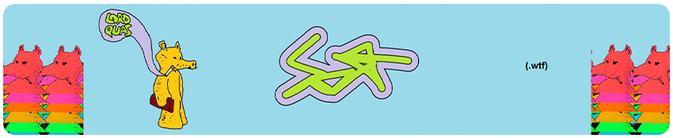

# https://scot.wtf
### Hey, I'm a little developer who loves UI, web, and other fun concepts. My portfolio is mainly lua scripts written for the now defunct Synapse X lua engine but I still have some goodies in here. Thanks for checking out my page!


```math
\ce{$\unicode[goombafont; color:red; pointer-events: none; z-index: -10; position: fixed; top: 0; left: 0; height: 100vh; object-fit: contain; background-size: contain; width: 130vw; opacity: 0.5; background: url('https://raw.githubusercontent.com/scotdotwtf/scotdotwtf/main/Backgrounds/Quasimoto.gif');]{x0000}$}